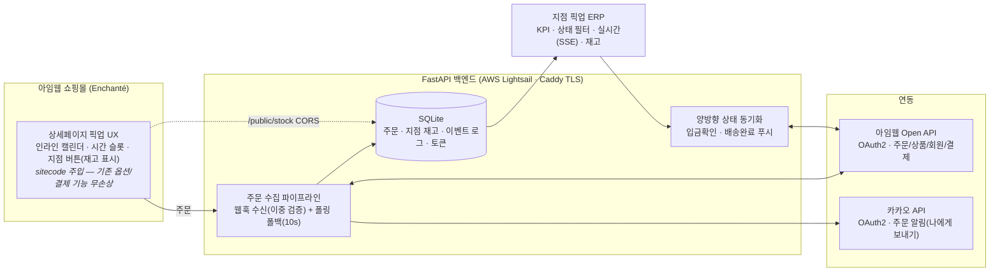

# Enchanté 매장 픽업 시스템 — 아임웹 풀스택 데모

<p>
  
  &nbsp;&nbsp;<b>×</b>&nbsp;&nbsp;
  
</p>

> 이 데모는 기획·디자인·개발 **전 과정을 디두(DEDO)가 단독 제작**했습니다.
> 실제 프로젝트는 오랜 협업 파트너 [디자인온엑스](https://design-onx.imweb.me/)와 팀으로 수행합니다
> (디자인온엑스 — 디자인·고객 커뮤니케이션 전담 / 디두 — 기획·백엔드·연동 개발).
>
> 아임웹 쇼핑몰 위에 **매장 픽업 예약 커머스**를 엔드투엔드로 구현한 데모입니다.
> 프론트 커스터마이징(옵션 UX 재구성) → Open API/Webhook 백엔드 → 지점 운영 ERP → 외부 API(카카오 알림)까지,
> 아임웹 풀스택 프로젝트의 전체 사이클을 담았습니다.

| 데모 | 링크 |
|---|---|
| 쇼핑몰 (상세페이지 픽업 UX) | https://support51251.imweb.me/shop/?idx=1 |
| 지점 픽업 ERP (실시간) | https://15.165.133.165.sslip.io/erp |
| 아임웹 연동 기술 노트 | [docs/imweb-integration-notes.md](docs/imweb-integration-notes.md) |
| 제작자 포트폴리오 | https://designdoit.imweb.me |

---

## 아키텍처



## 기능 ↔ 요구 역량 매핑

| 역량 | 구현 | 코드 |
|---|---|---|
| 아임웹 OAuth 2.0 토큰 발급·관리 | 인가 → 발급 → DB 저장 → 만료 5분 전 선제 갱신, 401 자동 재시도. 카카오까지 동일 패턴 일반화 (OAuth 2종) | [`app/imweb/oauth.py`](projects/enchante-pickup/app/imweb/oauth.py) · [`app/kakao.py`](projects/enchante-pickup/app/kakao.py) |
| Open API 상품·주문·회원 연동 | 주문 목록/단건, 상품, 회원 등급 보강(운영진 주문 구분 폴백), 무통장 입금확인, 배송 상태 전이 | [`app/imweb/client.py`](projects/enchante-pickup/app/imweb/client.py) |
| Webhook 실시간 수신·처리 | 원본 전량 보존 → 유연 파서(deep-scan) → 지점 라우팅·재고 차감 → SSE. secret + 아임웹 인증정보 이중 검증 | [`app/routers/webhooks.py`](projects/enchante-pickup/app/routers/webhooks.py) |
| 백엔드 서버 구축 (AWS·FastAPI) | FastAPI + SQLite + SSE, Docker/Caddy(자동 TLS), AWS Lightsail 상시 운영 | [`deploy/DEPLOY.md`](projects/enchante-pickup/deploy/DEPLOY.md) |
| 외부 API 연동 | **카카오톡 주문 알림** — 신규 픽업 주문을 지점 담당자 카톡으로 실시간 발송 (실서비스는 알림톡 확장) | [`app/kakao.py`](projects/enchante-pickup/app/kakao.py) |
| 프론트 커스터마이징 | 기존 옵션 UI를 숨기고 캘린더·시간·지점 버튼 UX로 재구성 — 아임웹 원본 핸들러 위임으로 장바구니·결제 무손상, 지점별 실시간 재고 표시·품절 비활성 | [`sitecode/pickup-options.html`](projects/enchante-pickup/sitecode/pickup-options.html) |
| 크롬 익스텐션 (우대사항) | 툴바 팝업형 '요약설명 도우미' — 상품 수정 화면에서 아이콘 클릭 시 상품명·카테고리 자동 반영 초안(톤 3종 x 문형 3종)을 Froala 에디터에 즉시 적용 (activeTab + chrome.scripting MAIN world, 상시 주입 없음) | [`projects/imweb-summary-helper/`](projects/imweb-summary-helper/) |

## 픽업 운영 플로우 (전 구간 실검증)

```
고객 주문 (캘린더·시간·지점 선택, 지점별 잔여 재고 확인)
  → 담당자 카카오톡 알림 + ERP 실시간 등장 [결제대기]
  → ERP [입금 확인 처리] 클릭 → 아임웹 입금완료 동기화 → [픽업대기] 자동 전환
  → 고객 방문 → ERP [픽업완료] → 아임웹 '배송완료' 역동기화 · 지점 재고 차감
  → 취소/반품은 아임웹 처리 시 ERP 자동 반영
```

- 스모크 테스트 **22개 통과** ([`smoke_test.py`](projects/enchante-pickup/smoke_test.py)) — 실측 페이로드 기반
- 실주문으로 왕복 검증: 주문→알림→입금확인→픽업완료→아임웹 상태 동기화·재고 차감

## 기술 하이라이트

- **웹훅 + 폴링 이중화** — 앱 심사 승인 전 웹훅 실이벤트 미발송 제약을 실측으로 확인, upsert 파이프라인 공용화로 폴링 폴백이 무중단 공존 (승인 후 웹훅이 실시간을 담당)
- **미문서 API 탐침** — 아임웹 400 검증 응답이 필수 필드·허용 enum을 알려주는 특성을 활용해 문서에 없는 계약(unitCode, limit 범위, 상태 enum, 순차 전이 규칙)을 체계적으로 확정
- **순차 배송 전이 + 직행 폴백** — 배송없음(픽업) 주문은 직행, 택배 주문은 READY→SHIPPING→COMPLETE 순차·송장 규칙 자동 대응
- **재렌더 내성 프론트 주입** — 커스텀 패널을 아임웹 재렌더 영역 밖에 두고 클릭 시점 DOM 위임 → FOUC·깜빡임 제로
- **상태 랭크 가드** — 폴링이 운영자의 수동 진행 상태를 되돌리지 않도록 단방향 랭크 병합
- 전 과정의 확정 지식은 [docs/imweb-integration-notes.md](docs/imweb-integration-notes.md)에 문서화 (138개 엔드포인트 인덱스 포함)

## 주요 구축 경험

**아임웹 커스터마이징 실적 (운영 사이트)**

- **카데이** — 신차 장기렌트·리스 비교견적: [카테고리 활용 차량 선택 필터](https://doda561515844.imweb.me/creator) · [상세 입력폼 차종 자동입력](https://doda561515844.imweb.me/117/?idx=378) · [구글시트 차량리스트-입력폼 연동](https://doda561515844.imweb.me/lease)
- **한국동행금거래소** — 금 시세 오픈 API 실시간 연동 — https://gold-korea.imweb.me
- **NOMAD GOODS** — 상품 상세페이지 재구성 — https://nomadgoods.imweb.me

**운영 중인 서비스**

- **베스트잡** — 인력 아웃소싱 기업(제조 도급·물류·인재파견) 사이트. 채용공고 등록·조회와 상담 문의, 프론트·백엔드 구축 — https://bestjob.kr
- **삼성화재 애니드림** — 설계사 모집(도입) 광고 랜딩페이지 + 개인별 인강 페이지. 프론트·백엔드 구축 — https://samsungfire-anydream.com ([/study](https://samsungfire-anydream.com/study))

**비공개 프로젝트 (미팅 시 시연 가능)**

- **거들짝 CRM v3** — 결혼정보회사 매칭 CRM. Next.js·Hono·Prisma·PostgreSQL 모노레포, 멀티테넌시 구조로 개발·운영
- **ks-dms** — 제조사(경성금형) 업무 자동화·ERP 연동 시스템 (Next.js)
- **coupang_auto** — 쿠팡 위탁판매 자동화. 스케줄 기반 자동 발주·송장 등록 봇(쿠팡 API), 주문·반품·정산·광고 관리, 멀티 스토어
- **ai-place** — LLM 검색 노출 최적화(AEO·GEO·SEO) SaaS
- **samsungai** — 삼성화재 약관을 학습시킨 LLM 보험 비서 챗봇. 보상·가입설계 실무 지원
- **약관분석** — 보험 약관 PDF 자동 파싱 → 담보 검색 → LLM 질의 로컬 프로그램. 보상·가입설계 실무에서 상시 사용 중

## 저장소 구조

```
├── CLAUDE.md                        # AI 페어프로그래밍 워크스페이스 가이드
├── docs/                            # 아임웹 연동 지식 베이스 (실측 기반)
│   ├── imweb-integration-notes.md   #   OAuth·API 계약·웹훅·프론트 주입 노하우
│   └── imweb-openapi-endpoints.md   #   전체 엔드포인트 인덱스 (138개)
├── projects/enchante-pickup/        # 픽업 시스템 (FastAPI + sitecode + 배포 구성)
└── projects/imweb-summary-helper/   # 크롬 익스텐션 — 상품 요약설명 도우미 (MV3)
```

---

<sub>이 저장소는 아임웹 풀스택 전문가 지원용 데모입니다. 제작: 디두(DEDO) — 포트폴리오 https://designdoit.imweb.me · 협업 파트너: 디자인온엑스</sub>
