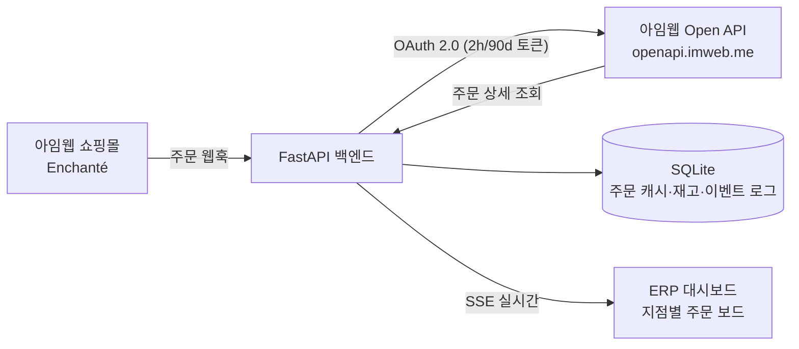

# Enchanté 지점 픽업 ERP — 아임웹 풀스택 데모 백엔드

아임웹 샘플사이트 [Enchanté](https://support51251.imweb.me/)의 **매장 픽업 주문**을
지점별로 실시간 관리하는 ERP 백엔드. 아임웹 풀스택 전문가 지원용 데모.

> 시나리오(공고 예시 1:1 대응): 상품 선택 → **기본형 옵션 '픽업 지점'** →
> **입력형 옵션 '픽업 희망일'** → 주문 → **웹훅 실시간 수신** → **지점별 ERP**에
> 주문 알림·재고 차감 반영.

## 아키텍처



- `app/imweb/oauth.py` — 인가코드 → 토큰 발급/자동 갱신 (만료 5분 전 선제 refresh)
- `app/imweb/client.py` — Bearer 인증 API 클라이언트 (401 시 갱신 후 재시도)
- `app/routers/webhooks.py` — 웹훅 수신: 원본 전량 로그 → 주문 파싱 → 지점 라우팅 → 재고 차감 → SSE
- `app/routers/erp.py` + `app/templates/erp.html` — 지점별 주문 보드·재고·브라우저 알림
- `app/routers/auth.py` — 최초 1회 OAuth 인가 플로우

## 실행

> 이 프로젝트는 `C:\dev\enchante-erp` 워크스페이스의 `projects/enchante-pickup/`에 있으며,
> venv는 워크스페이스 루트 `.venv`를 공용으로 쓴다.

```powershell
cd C:\dev\enchante-erp\projects\enchante-pickup
copy .env.example .env                               # 값 채우기
..\..\.venv\Scripts\python -m uvicorn app.main:app --reload --port 8000
..\..\.venv\Scripts\python smoke_test.py             # 테스트 (실API 호출 차단 상태로 15개 체크)
```

- `http://localhost:8000/auth/login` — 최초 1회 인가(토큰 발급)
- `http://localhost:8000/erp` — ERP 대시보드
- 웹훅 로컬 테스트: `cloudflared tunnel --url http://localhost:8000` 등으로 공개 URL 확보 후
  개발자센터에 `https://<터널>/webhooks/imweb?secret=<WEBHOOK_SHARED_SECRET>` 등록

**상시 운영 배포(AWS Lightsail + Caddy HTTPS)**: [deploy/DEPLOY.md](deploy/DEPLOY.md) 참고 —
`docker-compose.prod.yml` 하나로 자동 TLS까지 완료.

## 아임웹 연동 셋업 체크리스트

1. [개발자센터](https://developers.imweb.me) 로그인 → 앱 생성 → **Client ID/Secret** 발급
2. 앱에 **Redirect URI** 등록 (`.env`의 `IMWEB_REDIRECT_URI`와 일치)
3. **API Scope 활성화**: 주문·상품·회원 (웹훅은 해당 scope 활성화가 선행 조건)
4. **웹훅 등록**: 주문 생성/입금완료/취소 등 → 수신 URL은 이벤트당 1개
5. 개발자센터 **'테스트 보내기'**로 샘플 페이로드 수신 → `WebhookEvent` 테이블(원본 로그) 확인
6. `.env` 채우고 `/auth/login` 1회 → `/erp` 열고 테스트 주문

## 아임웹 연동 확정 스펙 (2026-07-23 실호출 검증 완료)

| 항목 | 값 |
|---|---|
| 인가 | `GET https://openapi.imweb.me/oauth2/authorize` (`responseType`·`clientId`·`redirectUri`·`scope`·`siteCode`·`state` — **camelCase**) |
| 토큰 발급/갱신 | `POST https://openapi.imweb.me/oauth2/token` (`grantType=authorization_code\|refresh_token`, JSON 본문 OK) |
| 토큰 수명 | Access **2시간** / Refresh **90일** (갱신 시 둘 다 재발급) — 실발급 확인 |
| **scope 명칭** | `site-info:write`(인가 필수) `order:read` `order:write` `product:read` — 형식 `카테고리:read\|write` |
| **API 경로** | `GET /site-info`, `GET /orders?page&limit&unitCode`, `GET /products?page&limit&unitCode` (limit 1~100) |
| **응답 봉투** | 성공 `{statusCode, data:{totalCount,totalPage,currentPage,pageSize,list[]}}` / 오류 `{statusCode, error:{errorCode,message,data}}` |
| **unitCode** | 사이트 하위 유닛 단위 — `/site-info`의 `unitList[].unitCode`. 주문/상품 조회 필수 |
| Rate limit | 버킷 25, 초당 2 회복 (`X-RateLimit-*` 헤더) |
| 주문 모델 | Order > OrderSection(배송상태 그룹) > OrderSectionItem — 섹션 상태 변경은 `orderSectionStatus` |
| 웹훅 | 개발자센터에서 이벤트별 URL 1개 등록, 주문 계열 30+ 이벤트, '테스트 보내기' 제공. 별도 '인증정보' 값이 이벤트와 함께 전달됨 |
| 앱 연동 | **테스트연동 상태로 전 API 사용 가능** (연동완료처리·심사 불필요). 에러 30132=사이트 미연동, 30156=필수 scope 누락 |

### TODO (남은 확정 항목)

- [ ] 주문 단건 조회 경로 (`/orders/{orderNo}` 추정) — 실주문 발생 시 검증
- [ ] 웹훅 실제 페이로드 스펙 → `webhooks.py` 파서를 deep-scan에서 정확 매핑으로 교체
- [ ] 웹훅 '인증정보' 전달 위치(헤더/바디) 확인 → 검증 로직 연결 (`IMWEB_WEBHOOK_AUTH`)
